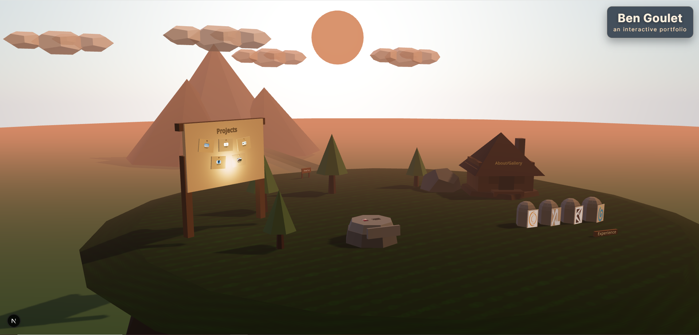

# Ben Goulet — Interactive Portfolio

**A cinematic, interactive portfolio built as a browser-based 3D experience.**

Rather than build a conventional scrolling portfolio, I designed [bengoulet.com](https://bengoulet.com) as a small explorable world: a low-poly mountain environment where different landmarks represent different parts of my work and life.

The site combines a React/Next.js application with a React Three Fiber scene, animated camera transitions, interactive 3D objects, a cabin interior, project and experience storytelling, and an accessible non-3D version using the same underlying content.

**Live:** [bengoulet.com](https://bengoulet.com)



---

## The idea

The portfolio is structured more like a point-and-click adventure than a traditional resume site.

From the main mountain scene, visitors can explore different landmarks:

- **Introduction** — an entry point into my background and what I build
- **Projects** — presented through an interactive billboard
- **Experience** — work history embedded into the environment
- **Cabin** — a more personal gallery and collection of interactive objects
- **Chasing 50** — an interactive map tracking my attempt to climb the highest point in every U.S. state

The goal was to make the site feel personal without sacrificing the ability to quickly understand my professional work.

---

## Stack

| Area | Technology |
| --- | --- |
| Framework | Next.js |
| UI | React, TypeScript |
| 3D | Three.js, React Three Fiber, Drei |
| Animation | GSAP |
| Styling | Custom CSS |
| Maps | `@svg-maps/usa` |
| Image processing | Sharp |
| Analytics | Vercel Analytics |

---

## Interactive 3D experience

The primary portfolio view is rendered with React Three Fiber.

The scene combines:

- low-poly `.glb` models
- custom environment geometry
- textured terrain and props
- interactive landmarks
- camera focus transitions
- scene-specific UI overlays
- lazy-loaded interior environments
- lighting and atmosphere
- quality and motion presets
- pointer and keyboard interaction

The camera is treated as part of the navigation system rather than just a viewport.

A simplified interaction flow looks like:

```text
Overview
   │
   ├── Introduction
   │
   ├── Projects Billboard
   │
   ├── Experience
   │
   ├── Chasing 50
   │
   └── Cabin
          │
          ├── Gallery
          ├── Interactive objects
          └── Personal details
```

Each destination moves the viewer through the scene rather than routing to an unrelated page.

---

## Scene architecture

Most of the interactive experience lives under `components/scene`.

```text
components/
├── PortfolioView.tsx
├── SimplePortfolio.tsx
└── scene/
    ├── AdventureScene.tsx
    ├── Billboard.tsx
    ├── Cabin.tsx
    ├── CabinInterior.tsx
    ├── CameraRig.tsx
    ├── IntroductionLandmark.tsx
    ├── LightingAtmosphere.tsx
    ├── LowPolyEnvironment.tsx
    ├── UnitedStatesMap.tsx
    └── StateDetailCard.tsx
```

`AdventureScene.tsx` coordinates the overall experience, while scene objects remain split into focused components.

Shared configuration for camera positions, interaction timing, visual settings, and quality presets lives under:

```text
config/
├── sceneConfig.ts
└── visualTokens.ts
```

This keeps tuning the environment separate from the actual interaction logic.

---

## Navigation as state

The portfolio uses explicit interaction states to coordinate camera movement, scene visibility, overlays, and selected content.

Instead of treating each interaction as an isolated click handler, the scene works more like a lightweight state machine:

```text
idle
  ↓
target selected
  ↓
camera transition
  ↓
focused experience
  ↓
detail interaction
  ↓
return transition
  ↓
idle
```

This became particularly useful once the environment expanded to include nested experiences such as the cabin interior and state-detail views.

---

## Cabin interior

The cabin is effectively a second environment inside the main experience.

It contains a personal gallery and a collection of interactive 3D objects, while sharing the same navigation and presentation system as the outdoor scene.

The interior is dynamically loaded rather than being included in the initial bundle:

```tsx
const CabinInterior = dynamic(
  () => import("./CabinInterior").then((module) => module.CabinInterior),
  { ssr: false }
);
```

That lets the initial portfolio experience load without requiring every model and cabin interaction up front.

---

## Chasing 50

One section of the portfolio tracks my attempt to climb the highest point in each U.S. state.

The interactive U.S. map is driven by structured state data rather than individually authored map components.

Each state can define:

- completion status
- mountain name
- route
- ascent date
- distance
- elevation gain
- difficulty
- notes
- photos or video

For example, completed highpoints can expand into a dedicated story card while incomplete states remain available for future entries.

The same data powers both the 3D experience and the accessible portfolio view.

---

## One content model, two experiences

The site intentionally has two presentation modes:

### Interactive 3D

The default experience at `bengoulet.com`.

Built for exploration, animation, and visual storytelling.

### Simple portfolio

A conventional semantic version containing the same:

- introduction
- experience
- projects
- gallery
- Chasing 50 content
- resume

Users can switch between the two at any time.

The simple version also acts as a resilient fallback if the WebGL experience fails to load.

```text
                    Shared content
                         │
             ┌───────────┴───────────┐
             │                       │
      Interactive scene        Simple portfolio
      React Three Fiber        Semantic React/HTML
             │                       │
             └───────────┬───────────┘
                         │
                  Same portfolio
```

This was important to me because an experimental interface shouldn't make the underlying information inaccessible.

---

## Resilience and accessibility

The site includes several fallbacks around the heavier 3D experience.

Examples include:

- a visible **View simple version** option during scene loading
- an error boundary that falls back to the simple portfolio
- a scene load timeout
- keyboard-accessible interactive map states
- focus-managed dialogs
- skip navigation
- semantic HTML in the simple view
- a `<noscript>` fallback
- persistent user preference between 3D and simple modes

That lets the site remain useful even when WebGL performance, device capability, JavaScript, or scene assets become a problem.

---

## Performance

3D portfolios can become unnecessarily expensive very quickly, so the project includes several tools for controlling asset cost.

### Texture optimization

The repository includes a Sharp-based texture downscaling utility:

```bash
npm run textures:downscale -- --dry-run
npm run textures:downscale -- --max-color 2048 --max-data 1024
```

Optimized textures are written separately so source assets can be preserved while smaller runtime versions are evaluated.

### Gallery thumbnails

Gallery thumbnails are generated automatically:

```bash
npm run gallery:thumbs
```

The process also runs as part of development, builds, and installation.

### Scene loading

Heavier experiences such as the cabin interior are lazy-loaded, and scene quality/motion settings are centralized in configuration rather than scattered throughout individual components.

---

## Content-driven structure

Experience, projects, gallery content, and state-highpoint stories are stored as structured data.

Examples:

```text
components/scene/
├── experienceData.ts
├── projectNotes.ts
├── introductionData.ts
├── cabinAssets.ts
└── stateEntries.ts
```

This means the portfolio UI does not need to be rewritten every time a project, job, photo, or highpoint is added.

Both presentation modes consume the same sources of truth.

---

## 3D assets

The scene combines original composition and development with third-party low-poly models.

Model attribution is maintained in:

```text
public/models/attributions.txt
```

Assets include work from creators distributed through sources such as Poly Pizza and Poly under their respective licenses.

---

## Running locally

### Requirements

- Node.js
- npm

Clone the repository and install dependencies:

```bash
npm install
```

Start the development server:

```bash
npm run dev
```

Then open:

```text
http://localhost:3000
```

Build the production version with:

```bash
npm run build
```

---

## Repository structure

```text
app/
├── layout.tsx
└── page.tsx

components/
├── PortfolioView.tsx        # Chooses interactive/simple presentation
├── SimplePortfolio.tsx      # Accessible semantic portfolio
└── scene/                   # 3D environment and content

config/
├── sceneConfig.ts           # Camera, quality, motion, scene configuration
└── visualTokens.ts

lib/
└── animation.ts

public/
├── experience/
├── gallery/
├── highpoints/
├── models/
├── projects/
├── textures/
└── textures-optimized/

scripts/
├── downscale-textures.mjs
└── generate-gallery-thumbs.mjs
```

---

## Development workflow

This project has been developed with extensive use of AI coding agents.

[`AGENTS.md`](./AGENTS.md) defines the working expectations I use for agent-assisted development, including local execution, visual verification, screenshots, and small testable changes.

I use these tools as part of the implementation workflow while retaining responsibility for the product direction, interaction design, architecture, review, debugging, and final behavior.

---

## About me

I'm **Ben Goulet**, a full-stack software engineer based in Durham, North Carolina.

I enjoy building products that sit somewhere between engineering, product design, and experimentation—particularly projects where the interface itself can be part of the experience.

**Portfolio:** [bengoulet.com](https://bengoulet.com)  
**GitHub:** [github.com/bwgoulet](https://github.com/bwgoulet)
